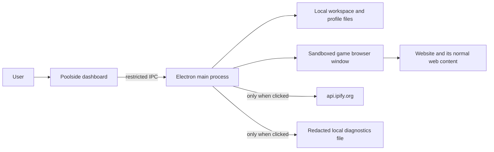

# Poolside threat model

**Status:** Living document

This document describes the security and privacy properties Poolside relies on today. It is a design
and review aid, not a promise that a Windows PC compromised by malware can be made safe by one
application.

## Current product surface

Poolside is a local Windows workspace for separate, persistent browser sessions. A person signs in
inside the corresponding browser window. Poolside does not display, export, or import passwords,
cookies, tokens, hidden account identifiers, or browser-page text. The one password the application does hold is
the **route's own** proxy username and password, when the provider gave one: that is stored in the configuration
document so the route can be used, it is shown in the dashboard only as `credentials set`, and it is refused by
the export scan rather than written to a document that can be sent on.

**What the build does now** (this paragraph was stale, and a security document that describes an older
application is worse than one that describes none): it coordinates matches between two of the operator's own
accounts and records the outcome operator-entered; it applies **per-session identity overrides** (user agent,
accepted languages, locale, time zone, viewport, colour scheme) that the browser may accept or refuse, per field;
it applies **routes** the operator supplies, and reads the exit address through a session when asked or when a
match is about to be released; and it can **read ten properties from each open session's own page** (user agent,
languages, language, time zone, locale, viewport, screen size, colour scheme, reported processor cores, reported
device memory) to show the operator two sessions side by side. That comparison is display-only: nothing is
written to the page, nothing is stored, and it is asked for rather than continuous.

**What is still deliberately not implemented**, recorded in [ADR-0011](adr/0011-game-automation-gaps.md):
input generation into game pages, and matchmaking-aware route selection. Two entries that used to be listed here
are now wrong and are corrected rather than left: multi-account coordination and outcome records are built
(locally, as described above), and device-fingerprint controls remain **absent by decision** — the identity
overrides are ordinary browser preferences applied per session (ADR-0012), not spoofing of hardware identifiers,
and the comparison's columns that the application does **not** change (processor cores, device memory) are
reported as they are.

## Assets worth protecting

| Asset                          | Why it matters                                                                              | Storage or path owner                                                                         |
| ------------------------------ | ------------------------------------------------------------------------------------------- | --------------------------------------------------------------------------------------------- |
| Browser profile                | May contain an authenticated website session and normal browser storage                     | Chromium persistent partition, managed by `profiles.cjs`                                      |
| Session carry-over             | Preserves session-only cookies when Chromium closes                                         | `%APPDATA%/Poolside/accounts/<id>.plist`, encrypted with Electron `safeStorage`/Windows DPAPI |
| Workspace metadata             | Account labels, roles, normal session settings, window geometry, and optional local notes   | `%APPDATA%/Poolside/workspace.json`                                                           |
| Capture Lab records and images | User-approved screen images plus minimal recognition result and timing                      | `%APPDATA%/Poolside/recognition-lab/`                                                         |
| Activity journal               | Redacted local troubleshooting messages                                                     | `%APPDATA%/Poolside/activity-history.json`                                                    |
| Diagnostics export             | Redacted, user-requested support evidence                                                   | `%APPDATA%/Poolside/diagnostics/`                                                             |
| Saved network location         | A route address, and **its username and password in plain text** when the provider gave one | `%APPDATA%/Poolside/workspace.json`, and the same document's accounts                         |
| Run record                     | Who played whom, each match's verdict, saved location **by name**, and balance readings     | `%APPDATA%/Poolside/diagnostics/poolside-run-report-*.json`                                   |

A local note is ordinary workspace metadata. It is never gathered from the website, but it is not a
secure vault: users must not write passwords, recovery codes, tokens, or private information there.

## Trust boundaries

The dashboard is trusted to request only its documented actions after the main process verifies the
sender. A game page is not trusted with privileged application access. It has no Node.js integration
and no Poolside preload bridge. It remains a normal browser page, so its own third-party scripts,
login providers, and website risks are outside Poolside's ability to control.

## Threats and current controls

| Threat                                                              | Controls in the current build                                                                                                                                                                                                         | Residual risk                                                                                                                                                                               |
| ------------------------------------------------------------------- | ------------------------------------------------------------------------------------------------------------------------------------------------------------------------------------------------------------------------------------- | ------------------------------------------------------------------------------------------------------------------------------------------------------------------------------------------- |
| Malicious page reaches app privileges                               | Game windows have no Node.js/preload bridge; dashboard IPC verifies the exact dashboard main frame; navigation, popups, downloads, and unsupported schemes are restricted                                                             | A browser or Electron vulnerability could still escape its sandbox; keep Electron updated and avoid untrusted sites in a session window                                                     |
| One account sees another account's storage                          | One persistent Chromium partition per account; desktop tests exercise separate cookie jars and retained sessions                                                                                                                      | Website-side linking and account policy decisions are not controlled by Poolside                                                                                                            |
| A page causes unintended local file download or external navigation | Download handling and unsafe custom-scheme/navigation paths are blocked in session windows                                                                                                                                            | Normal allowed website content still loads from the website and its providers                                                                                                               |
| Recovery metadata exposes session material at rest                  | Session-only carry-over is encrypted through Windows DPAPI; profile data remains in its Chromium profile                                                                                                                              | Someone with access to the same unlocked Windows account may access local profile data; a compromised PC is not in scope                                                                    |
| Diagnostics or activity history exposes identity or secrets         | Activity persistence redacts account labels, paths, IPs, and token-shaped strings; diagnostics use a separate anonymising projection and final secret scan                                                                            | Pattern scans are a floor, not proof; never export diagnostics with sensitive page content visible                                                                                          |
| Capture Lab stores a sensitive sign-in screen                       | Capture requires an explicit user confirmation; review and deletion are available; OCR returns only matched rule phrases; the manifest has a fixed metadata allowlist                                                                 | The user must still inspect the screen first. A capture is not automatically safe because it is local                                                                                       |
| Corrupt profile/session data loses access                           | Damaged carry-over is quarantined rather than silently deleted; profile deletion needs native confirmation and is refused while open                                                                                                  | Persistent web storage can still expire or be invalidated by the site, requiring a normal sign-in                                                                                           |
| Tampered configuration produces invalid browser behavior            | Settings and account overrides pass schema validation before use; unsupported fields are rejected or ignored with an activity warning                                                                                                 | Normal browser preferences do not guarantee any particular website behavior                                                                                                                 |
| Malicious package or dependency                                     | Pinned Node dependencies, static architecture checks, test/type/lint gates, and a local package self-test                                                                                                                             | Portable release folders are not yet code-signed or independently clean-machine validated                                                                                                   |
| Route credentials readable at rest                                  | They are never shown in the dashboard or written to an export, the snapshot and IPC carry `credentials set` instead, and both the diagnostics payload and the run report refuse a credential-shaped string                            | They are stored in plain text inside the workspace document, so anyone with access to the same unlocked Windows account can read them; DPAPI encryption of that document is not implemented |
| Reading values from a game page discloses page content              | The comparison reads ten named browser properties and returns them to the dashboard; it writes nothing to the page, stores nothing, runs only when the operator asks, and the panel states that it is not a promise about any website | The properties are read from a page the operator is signed in to, so a support discussion about them should stay in the panel rather than in a screenshot                                   |

## Network behavior

The dashboard CSP is `connect-src 'none'`: it makes no network request by itself. Poolside has no
analytics endpoint, remote configuration, remote code loader, automatic updater, or bundled VPN.

The **Check IP** action is the exception. When a user presses it, the main process requests
`api.ipify.org` through that selected browser session, without cookies, to display the public IPv4
observed by that endpoint. The address is kept in memory for the window session and is redacted from
activity and diagnostics. It does not prove location, VPN status, IPv6 routing, or the game's network
route.

## Data handling and removal

| Data                                          | How to remove it                                                                                                                                                                                               |
| --------------------------------------------- | -------------------------------------------------------------------------------------------------------------------------------------------------------------------------------------------------------------- |
| One account's browser session                 | Close the account window, then use **Delete profile** on the account card. This removes that account's profile and carry-over files; it requires sign-in again.                                                |
| An account slot and local profile             | Remove it from **Account management** after closing its window.                                                                                                                                                |
| Saved network locations and their credentials | Remove the location in Settings once no account uses it (a location still ticked on for an account is refused). The credentials live in the workspace document, so removing the location is what removes them. |
| A Capture Lab image and record                | Use **Delete** on that sample.                                                                                                                                                                                 |
| Redacted activity messages                    | Use **Erase saved activity history** in Activity. It does not alter browser profiles.                                                                                                                          |
| Redacted diagnostics files and run reports    | **Files Poolside has written** in Settings lists them and erases them behind a native confirmation; it touches nothing else in that folder.                                                                    |
| All Poolside data                             | Uninstall the application and remove the Poolside directory in `%APPDATA%` only after closing Poolside. This irreversibly removes local browser sessions.                                                      |

## Verification evidence

The following checks are part of the local development gate:

- `npm run verify`: lint, type checks, model/profile/capture/diagnostic tests, and static UI/accessibility checks.
- `npm run test:desktop`: isolated Electron checks for cookie separation, profile lifecycle, IPC sender validation, sandboxed dashboard, local OCR, and diagnostics redaction.
- `npm run package`: rebuilds the portable Windows release from the checked source tree.
- `npm run sbom`: regenerates `docs/SBOM.cdx.json` from `package-lock.json`; `npm run sbom:check` refuses an inventory that has drifted from that lockfile.
- `npm run release:inspect`: prints SHA-256 hashes of the portable executable and its packaged app archive for the release record.
- `npm run docs:check`: refuses an architecture document whose module inventory no longer matches `src/`.

CI retains the reports each run produces — the verification output, the restart-persistence proof, the corpus
contract, the dependency check, the package log and the packaged self-test's own output — as
`poolside-verify-evidence` and `poolside-preview-release-evidence`, on a failing run as well as a passing one.

The tests provide evidence for the stated controls. They do not prove that third-party web content is
safe, that a Windows account is malware-free, or that an unsigned portable executable cannot be
replaced after it is built.

## Remaining security work

1. Use the checked-in CycloneDX SBOM during a documented dependency and vulnerability review for each release.
2. Establish an independently clean-machine installation and package inspection procedure.
3. Decide whether releases will be code-signed. If so, document certificate custody, signing, and
   verification rather than treating a signature as a checkbox.
4. Perform the release checklist in `docs/release-checklist.md` for each candidate build, retaining the
   Electron version, SBOM/dependency review, test results, package hashes, and known limitations.
5. **Decide what to do about route credentials at rest.** They are in plain text in the workspace document today.
   Encrypting that document (or just those values) through `safeStorage` changes what a backup and a DPAPI-encrypted
   carry-over file can promise across Windows accounts, so it is a decision with consequences rather than a patch;
   ADR-0013 and the backup manifest both have a stake in it.

## Review triggers

Update this document before merging a change that:

- adds a new local data store, a new external request, or an export path;
- expands dashboard IPC or changes the game-window sandbox/preload policy;
- changes profile, capture, or diagnostics retention;
- adds a dependency with native code or an updater; or
- changes any boundary recorded in ADR-0011.
